---
title: "Midterm Project"
author: "Nilanjana Nambiar"
date: "11/15/21"
output:
  xaringan::moon_reader:
    lib_dir: libs
    nature:
      highlightStyle: github
      highlightLines: true
      countIncrementalSlides: false
---

## Visualization 1

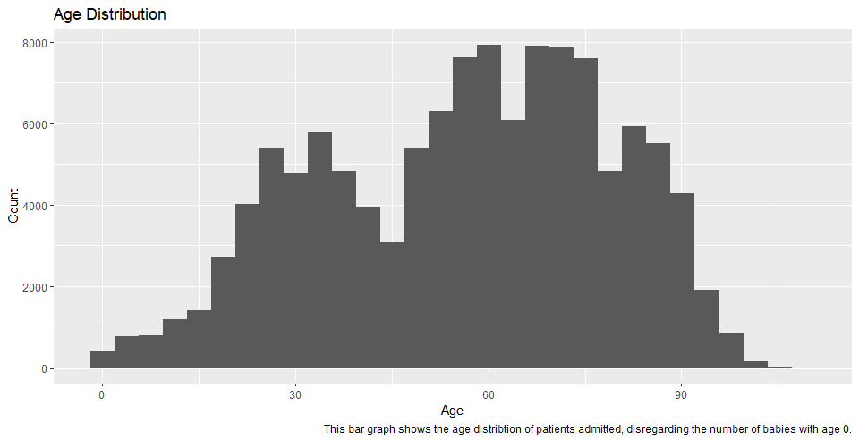
---

## Visualization 2
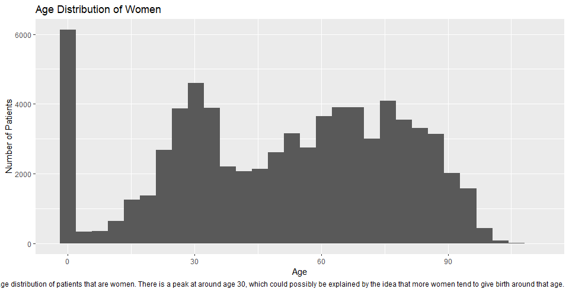
---

## Visualization 3
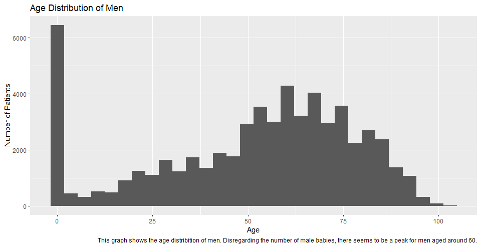
---

## Visualization 4
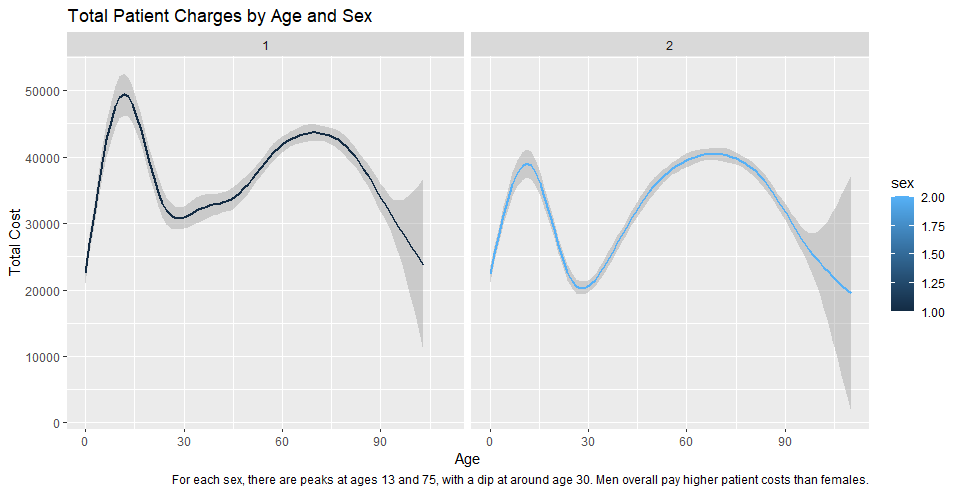
---

## Visualization 5
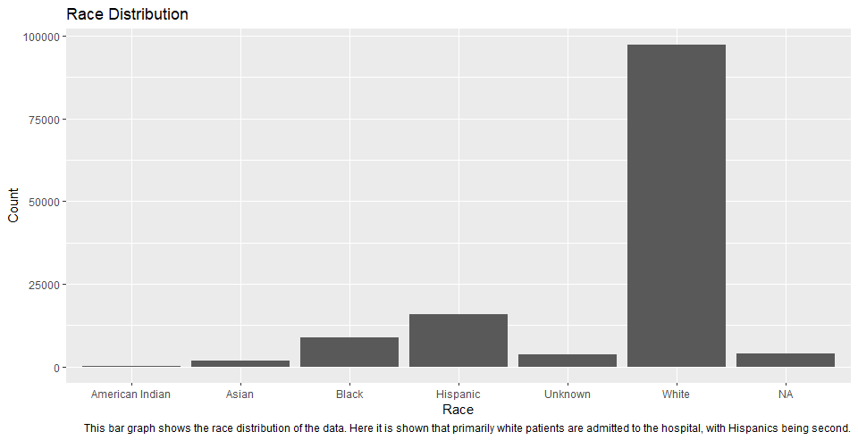
---

## Visualization 6
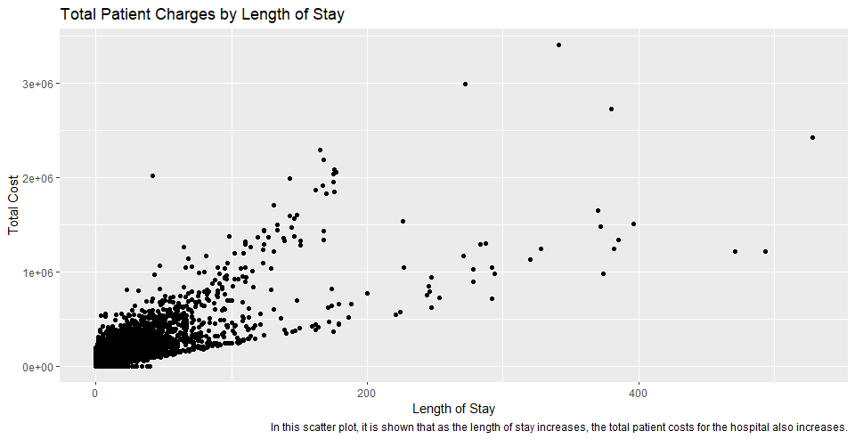
---

## Visualization 7
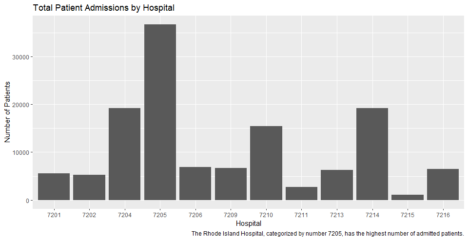
---

## Visualization 8
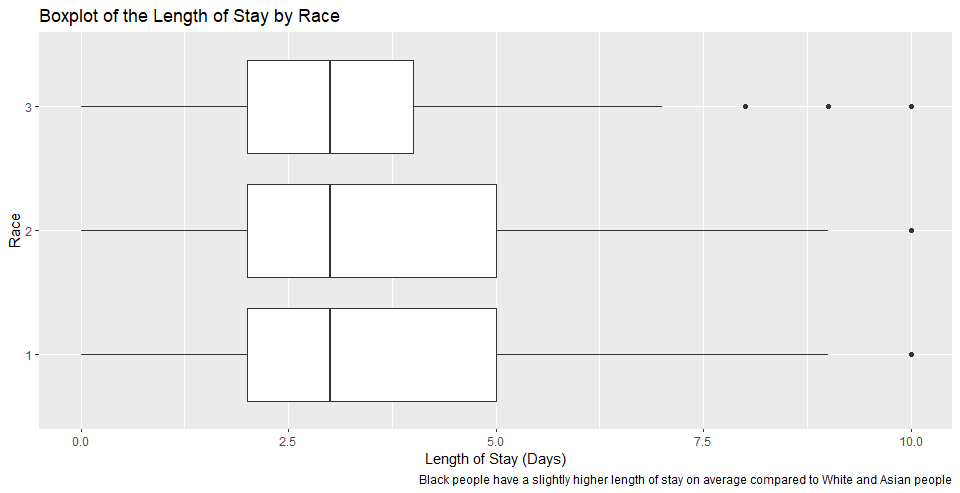
---

## Visualization 9
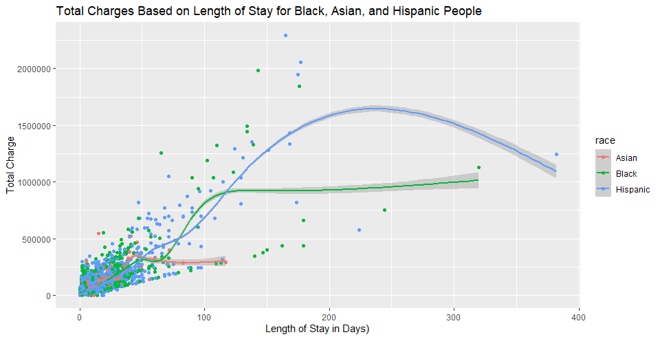
---

## Visualization 10
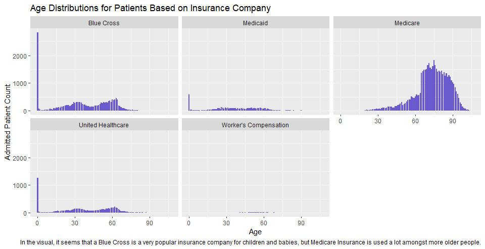
---

## Visualization  11
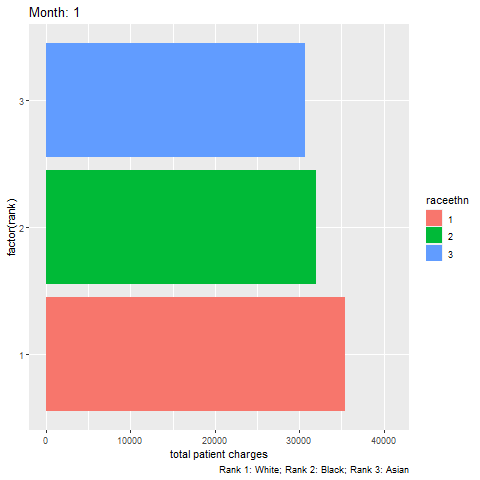
---

## Prediciting Total Patient Charge

- Target Variable: Total Patient Charge (tot)

-`low` if the total charge of a patient (`tot`) is smaller than the median of the total charge, and

- `high` otherwise. 

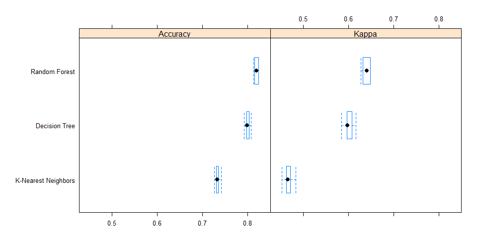
---

## Predicting Length of Stay

- I created a binary variable from the los column. I used 3 since that is the median los value.
- los < 3, "low"
- los >= 3, "high"

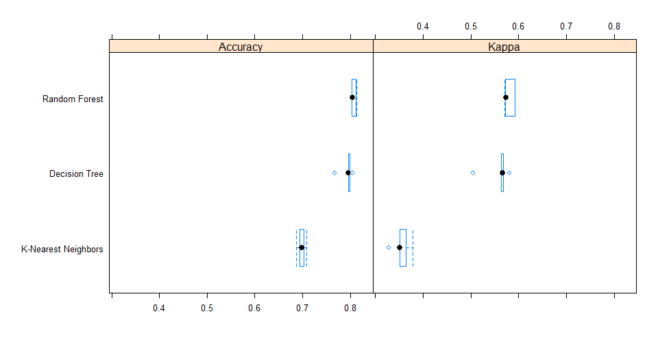
---

## Challenges

- Run time for models
- Some variables were not clear or did not have enough information/values
-adding in images was a challenge
- Kniting and pushing files to Github